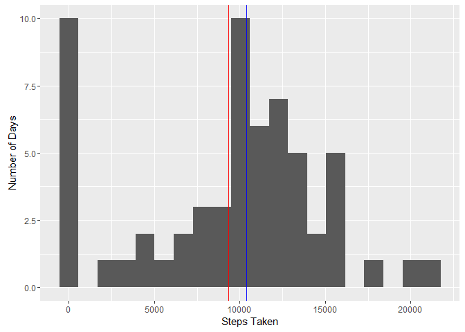
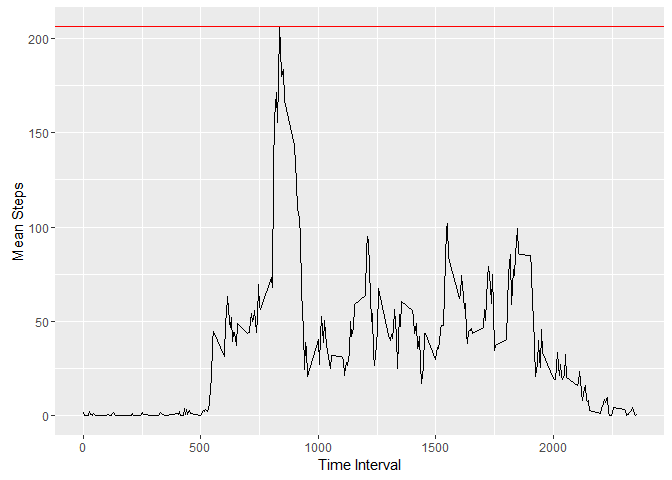
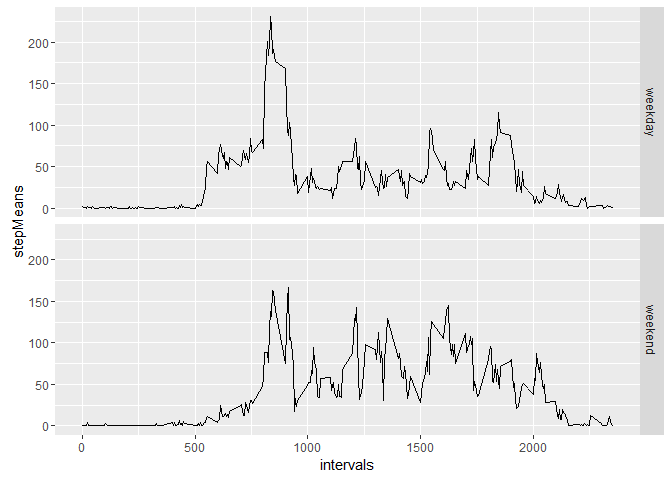

# Reproducible Research: Peer Assessment 1


## Loading and preprocessing the data

The first step is to load the data into R. It will also be necessary to ensure the "date" column is formatted as a proper date variable.


```r
df1=read.csv(unz("activity.zip","activity.csv"))
df1$date=as.Date(df1$date)
```

## What is mean total number of steps taken per day?

At this point, 'df1' is a data frame of three variables ("steps", "date", "interval").

In order to find the mean and median numbers of steps per day, it is necessary to find the the sum of "steps" for each unique "date".


```r
uniqueDates=unique(df1$date)
stepSums = sapply(uniqueDates, function(x){   sum(df1[df1$date==x,1],na.rm=TRUE)   })
```

Then it is simple to find the mean and median of this vector.


```r
dailyMean = mean(stepSums)
dailyMean
```

```
## [1] 9354.23
```

```r
dailyMedian = as.numeric(median(stepSums))
dailyMedian
```

```
## [1] 10395
```

These values can be plotted on a histogram of the total number of steps taken on a single day.


```r
qplot(stepSums, geom="histogram", bins=20, xlab="Steps Taken",ylab="Number of Days") +
    geom_vline(xintercept=dailyMean, color="red") +
    geom_vline(xintercept=dailyMedian, color="blue")
```

<!-- -->

## What is the average daily activity pattern?

The previous section averaged the number of steps on unique dates, while ignoring any dependency on unique time intervals. This section will average steps taken in unique time periods while ignoring the dependencies on unique dates.

First, it is necessary to find the mean of the "steps" values pertaining to every unique time interval.


```r
uniqueIntervals = unique(df1$interval)
stepMeans = sapply(uniqueIntervals,function(x){   mean(df1[df1$interval==x,1],na.rm=TRUE)   })
#this data frame will be used in step 4
intervalSteps = data.frame(stepMeans,uniqueIntervals)
```

Then we generate a plot based on this information.


```r
qplot(uniqueIntervals,stepMeans,geom="line",xlab="Time Interval",ylab="Mean Steps") +
    geom_hline(yintercept= max(stepMeans), color="red")
```

<!-- -->

Note the horizontal line denoting the curve's peak at 206.1698, where interval equals 835.

## Imputing missing values

The data set contains numerous missing values in the "steps" column, counted by the following line of code.


```r
countNA = as.numeric(sum(is.na(df1$steps)))
countNA
```

```
## [1] 2304
```

It is impossible to derive information from nothing, but given the values listed in similar rows we may be able to guess the missing values in "steps". In this case, we will simply replace any NA value in "steps" with the value in 'stepMeans' which corresponds to the same time interval. The following code generates a data frame which differs from 'df1' only in that its NA values have been replaced.


```r
df2 = df1
stepNA = is.na(df2$steps)
for(i in 1:length(df2$steps))
{
    if(stepNA[i])
    {
        df2[i,1]=intervalSteps[uniqueIntervals==df2[i,3],1]
    }
}
```

## Are there differences in activity patterns between weekdays and weekends?

Using the abridged data frame 'df2', we will now explore differences the data demonstrates between weekend and weekday activity patterns. First, we will further modify 'df2' so as to include a fourth column ("type"), which will tell us whether a given date is a weekday or a weekend.


```r
typify = function(x){
    if(weekdays(x) %in% c("Saturday","Sunday"))
        "weekend"
    else
        "weekday"
}
df2$type = sapply(df2$date,typify)
```

Next, in order to chart the daily activity patterns for weekdays and weekends respectively, we perform much the same operations as in step 3, save that this time we control for "type" and receive as output two vectors rather than one.


```r
WDstepMeans = sapply(uniqueIntervals,function(x){   mean(df2[df2$interval==x & df2$type=="weekday",1],na.rm=TRUE)   })
WEstepMeans = sapply(uniqueIntervals,function(x){   mean(df2[df2$interval==x & df2$type=="weekend",1],na.rm=TRUE)   })
```

Now we have two vectors, one with average activity per time interval for days between Monday and Friday, and one with average activity per time interval for Saturdays and Sundays. To conclude, we plot these vectors against the unique values of "interval" in two adjoining panel plots.


```r
df3 = data.frame(c(WDstepMeans,WEstepMeans),rep(uniqueIntervals),c(rep("weekday",length(uniqueIntervals)),rep("weekend",length(uniqueIntervals))))
colnames(df3)=c("stepMeans","intervals","type")
plot = ggplot(df3,aes(intervals,stepMeans)) +
    facet_grid(type~.) +
    geom_line()
plot
```

<!-- -->
